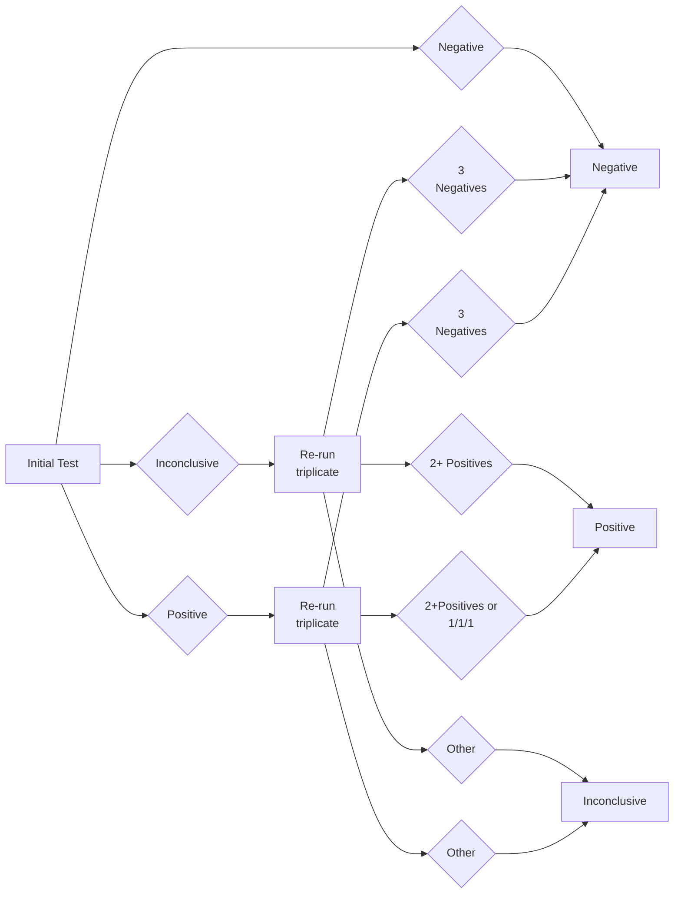

METADATA
last updated: 2025-12-15 RT updated metadata after BA fixed
file_name: Resulting Decision Flow Chart (Single Triplicate Re-run) v1.2.md
file_date: 2022-
title: Resulting Decision Flow Chart (Single Triplicate Re-run) v1.2
category: guides
subcategory: test-site
tags: 
source_file_type: pdf
xfile_type: NA
gfile_url: 
xfile_github_download_url: NA
pdf_gdrive_url: https://drive.google.com/file/d/1Yzxo03RifzDk05rTzOVQn3MM4mpcoIEK
pdf_github_url: 
conversion_input_file_type: pdf
conversion: ai (claude sonnet 3.5)
status: wip
license: CC BY 4.0 - https://creativecommons.org/licenses/by/4.0/
tokens: 
words: 
notes: uses mermaid diagram
summary_short: The Resulting Decision (Single Triplicate Re-run) Flow Chart v1.2 defines how to assign final Negative, Positive, or Inconclusive results based on an initial test outcome followed by a single triplicate re-run when needed. It standardizes interpretation thresholds (e.g., 2+ positives or specific mixed patterns) so staff can make consistent resulting calls across runs.

CONTENT

# Resulting Decision Flow Chart (Single Triplicate Re-run)  v1.2

